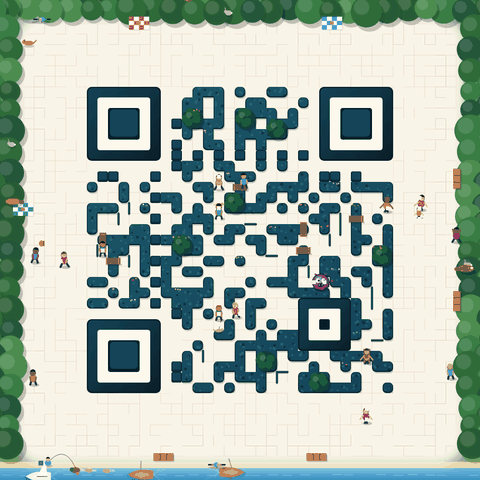
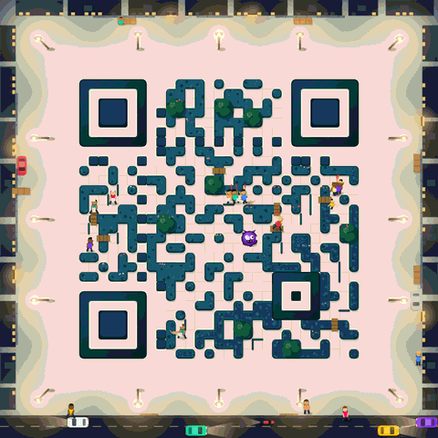

<div align="center">

# Maze QR

**A real, scannable QR code drawn as a living maze.**
People wander it, a monster hunts them, and the code is built to stay readable while it moves.

[](https://github.com/phoseinq/mazeqr/actions/workflows/ci.yml)
[](https://phoseinq.github.io/mazeqr/demo/)


[](LICENSE)




**[Try the demo](https://phoseinq.github.io/mazeqr/demo/)** · [Gallery](https://phoseinq.github.io/mazeqr/demo/gallery.html) · [Docs](https://phoseinq.github.io/mazeqr/demo/#docs)

</div>

## Why it is interesting

- **The maze is the code.** Dark modules are hedges, light ones are paths. Nothing is pasted on top of a QR code.
- **Animated, yet it stays readable.** After every frame, the centre of every module is forced back to its bit's tone, so a moving figure can tint a module but never flip it.
- **A small world.** People flee the monster along routes it can't reach first, vault a hedge when they are cornered, and gang up on it in the garden. Day brings a forest and a river, night brings a city.
- **Plain JavaScript and Canvas.** No server, no CDN, no build step. The text you encode never leaves the browser.

## Quick start

Copy `vendor/qrcode-generator.min.js` and `src/maze-qr.js`, then:

```html
<div id="qr"></div>
<script src="vendor/qrcode-generator.min.js"></script>
<script src="src/maze-qr.js"></script>
<script>
  var canvas = renderArtisticQr("https://example.com/", 1000);   // a live <canvas>
  canvas.style.width = "100%";
  document.getElementById("qr").appendChild(canvas);
</script>
```

| You want | Write |
|---|---|
| Night (or day) only | `renderArtisticQr(text, 1000, {night: true})`. Leave it out to follow `<html data-theme="dark">`. |
| A PNG | `renderArtisticQr(text, 1200, {still: true}).toDataURL("image/png")` |
| The "link copied" reaction | `mazeCheer(text)` |
| A small live icon that follows the monster | `renderArtisticQr(text, 700, {thumb: true, lens: {mods: 13, size: 132}})` |
| Pause / resume | `canvas.__stop()` / `canvas.__start()` |
| Animation despite *reduced motion* | `{motion: true}` |

The full API is on the [docs page](https://phoseinq.github.io/mazeqr/demo/#docs). Every tunable (error correction, quiet zone, colours, number of people, speeds…) is in the `MAZE` object at the top of `src/maze-qr.js`.

## Test results

Both suites run in [CI](.github/workflows/ci.yml) on every push.

**Scannability.** 20 renders (4 texts × day, night, the copy reaction, 600 px, 360 px), each read 15 ways by three decoders:

| Conditions | Reads | ZXing | ZBar | quirc (OpenCV) |
|---|---:|---:|---:|---:|
| Plain (full size, ½, 0.4×) | 60 | **100%** | **100%** | 98.3% |
| Hard (blur, JPEG q30, low contrast) | 80 | **100%** | 88.8% | **100%** |
| Camera-like (tilt, blur, noise, JPEG) | 160 | 98.8% | 98.1% | 92.5% |
| **All** | **300** | **99.3%** | **96.0%** | **95.7%** |

Every module centre is in tone in all 20 renders (`verifyCores`).

**Behaviour.** 15 simulated minutes per code (`node tests/behaviour.js`):

| Code | QR | People inside | Caught / min | Chases ending in a vault | Time clumped | Longest clump | Monster on a finder |
|---|---|---:|---:|---:|---:|---:|---:|
| `example.com/hello-maze` | 29×29 | 9.5 / 16 | 2.5 | 25% | 2.5% | 4.5 s | 0 s |
| `example.org/menu` | 29×29 | 8.6 / 16 | 2.6 | 27% | 7.6% | 5.6 s | 0 s |
| `example.net/a/b/c?x=1` | 29×29 | 9.1 / 16 | 2.1 | 22% | 2.2% | 2.7 s | 0 s |
| `example.com/s/k2o3…` | 37×37 | 10.2 / 16 | 1.5 | 31% | 1.0% | 3.2 s | 0 s |

A *clump* is three or more people stuck within 1.5 modules for 4 s. On the first version of the engine the same checks
failed for every code: clumps of up to 6 minutes, crowds stuck 18–68% of the time, and the monster cutting across finder patterns.

## What it can do, and where it stops

**Strengths**

- **Readability holds by construction, not by luck.** The bits come from a QR library and the art can only push a module *further* towards its own tone. Error correction is left as a safety margin, so a smudge or a reflection still has room to be fixed.
- **The same text always gives the same maze.** The layout, props and crowd are seeded from the text, and `time` reproduces an exact moment. That makes stills, screenshots and tests repeatable.
- **It degrades gracefully.** At full density you get the whole world. As the code gets smaller, the art simplifies in steps, down to a plain code below 5 px per module.
- **Private and portable.** Two scripts, no network calls, no dependencies to audit beyond qrcode-generator.

**Limits**

- **Pixels per module.** The full art needs about 12 screen pixels per module. Text length sets the QR version: a 30-character link is 29×29 modules and gets the full art from a canvas of about 520 px, while a 100-character link is 49×49 and needs about 800 px. **Short links look best.**
- **Strict colours.** Dark cores must stay at or below 0.16 relative luminance and light ones at or above 0.91 (0.76 at night). Brand palettes have to fit inside those limits, and the code is always dark-on-light, even at night.
- **Decoders differ.** The ZXing decoder reads 99.3% of the test set. On rough camera-like images quirc drops to 92.5%, and on heavily degraded ones ZBar drops to 89%. The camera tests are synthetic: real phones under glare are not part of CI.
- **CPU and battery.** A live canvas repaints at 30 fps on the main thread. One or two per page are fine; for galleries, lower `fps`, pause off-screen canvases (the gallery does), or use `still`.
- **Shared crowd.** Canvases showing the same text share one simulation (that is how the icon follows the same monster). The crowd's day/night behaviour follows the page theme, so a canvas forced to `night: true` on a light page shows daytime activities like swimming.
- **Screens first.** Print isn't validated. Export a high-resolution `still` and test it with a phone before printing.
- **Plain globals.** It ships as two classic scripts with global functions, not as an ES module or npm package.

## How it works

```
text → qrcode-generator → module matrix → reserved map → maze & world → protected patterns → safe cores → frame
```

Finder, timing, alignment, format and version modules are drawn whole and nothing walks over them. Light modules
become a graph of paths: people move on it with breadth-first search, flee towards cells the monster can't reach
first, and the scenery lives beyond the quiet zone. After each frame, every module the animation touched is clamped
back to its bit's tone.

## Development

```bash
node tests/behaviour.js            # behaviour regression checks (CI)
node tests/sim.js "<text>" 10      # behaviour stats for any text

# scannability: render in headless Chrome, then read with three decoders (CI)
chrome --headless=new --allow-file-access-from-files --virtual-time-budget=60000 --dump-dom tests/render.html > tests/dump.html
pip install pillow numpy zxing-cpp pyzbar opencv-python-headless
python tests/read_test.py tests/dump.html --check
```

## Licence

[MIT](LICENSE). Includes [qrcode-generator](https://github.com/kazuhikoarase/qrcode-generator) by Kazuhiko Arase (MIT).
