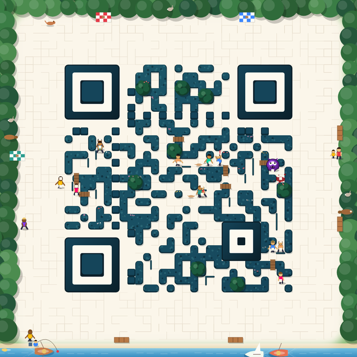
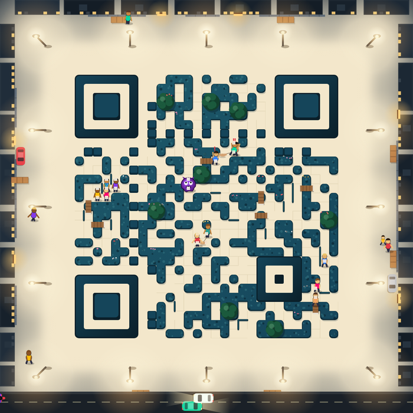
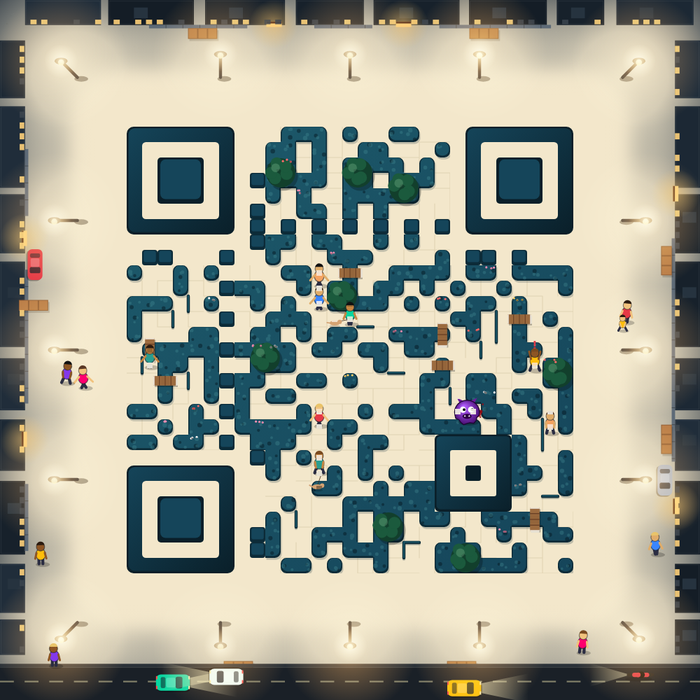
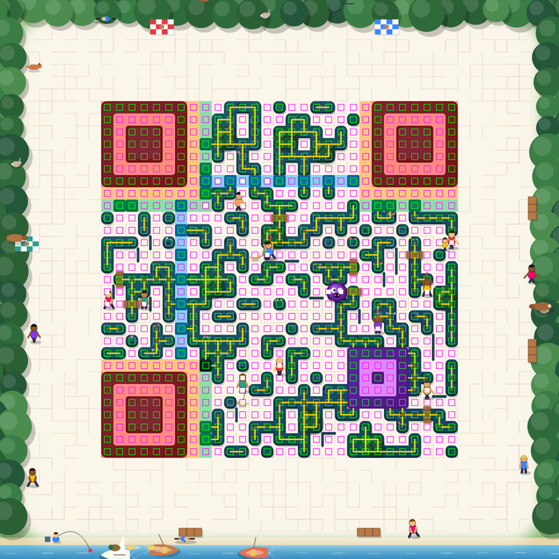

# Maze QR

A real, scannable QR code drawn as a living hedge maze — people wander its corridors, a monster
hunts them, a forest by day and a city by night grow round it. Plain JavaScript and Canvas, no
server, no CDN, no image generation.

**کد QR واقعی و قابل‌اسکن، به شکل یک هزارتوی زنده.** آدم‌ها در راهروها راه می‌روند، هیولا دنبالشان
می‌کند، روزها جنگل و شب‌ها شهر دور کد است. همه‌چیز در مرورگر ساخته می‌شود.

| Day | Night | On copy | Debug view |
|---|---|---|---|
|  |  |  |  |

Try it: open [`demo/index.html`](demo/index.html) (type any text, switch day/night, press *React*)
or [`demo/gallery.html`](demo/gallery.html).

## How it stays readable

The artwork is a skin over a mathematically valid QR. The bits are never derived from the drawing:

```
text → qrcode-generator → module matrix → reserved map → maze & world → protected patterns → safe cores → frame
```

1. **The matrix** comes from [qrcode-generator](https://github.com/kazuhikoarase/qrcode-generator) and nothing else.
2. **A reserved map** marks the finders, separators, timing, alignment, format and version modules. They are
   drawn as whole, high-contrast modules; nothing walks over them.
3. **The maze** is built from the bits: dark modules become hedges (joined into walls by their neighbours),
   light modules become paths. A randomised depth-first spanning tree over the paths adds thin walls (in the
   gutters between modules) and small wooden bridges join the separate parts.
4. **Safe cores.** After everything is drawn — and again after every animation frame, around whatever moved —
   the centre of each module (`SAFE_CORE_RATIO`, 50% still, 34% under moving sprites) is clamped to its bit's
   tone: dark ≤ 0.16 relative luminance, light ≥ 0.91 (0.76 at night). Colours are darkened or lightened,
   keeping their hue, so a figure crossing a module shows as a tinted patch, not a hole.
5. **The quiet zone** (4 modules by day, 2 at night) is the maze's own floor; scenery starts beyond it.

Error correction is a safety margin, not a budget: the rendered image keeps (almost) every module's value before
Reed–Solomon is needed. `verifyCores(canvas)` checks every core of a frame.

## Use

```html
<script src="vendor/qrcode-generator.min.js"></script>
<script src="src/maze-qr.js"></script>
<script>
  // a live canvas; it follows <html data-theme="dark"> and cross-fades between day and night
  var canvas = renderArtisticQr("https://example.com/", 1000);
  document.body.appendChild(canvas);

  // a small live "lens" on the maze that follows the monster (for an icon)
  var icon = renderArtisticQr("https://example.com/", 700, {thumb: true, lens: {mods: 13, size: 132}});

  mazeCheer("https://example.com/");      // the reaction (people jump, cars crash / boats fight)
  canvas.__stop();                        // stop animating; canvas.__start() to resume
</script>
```

Options: `night` (true/false; omit to follow the page), `still` (one frame), `motion` (true to animate even when the OS asks for reduced motion), `time` (seconds, for tests),
`characters` / `props` (false to turn the art off), `debug: {showReservedModules, showSafeCores, showConnectivity,
showModuleGrid, hideArtwork}`. All tunables sit in the `MAZE` object at the top of `src/maze-qr.js`
(error correction, quiet zone, core ratios, luminance limits, people count, speeds, palettes…).

Below about 12 pixels per module the art simplifies; below 5 it falls back to a plain code.

## What lives in it

- **The maze:** people walk through from one gate to another, pause at junctions, sit on benches, swim, go home
  at night; a monster hunts them by breadth-first search, people flee along paths the monster can't reach first,
  hop the low walls when cornered, tire when they run; outside the maze people give the monster a beating.
- **Day:** forest, river with boats (a pirate battle on copy), ducks, an angler, picnics, cyclists, a dog,
  rabbits, squirrels, a campfire, a ball game — scenes chosen by a small director, a few at a time.
- **Night:** city blocks with lit windows, street lamps, traffic with headlights, parked cars that change every
  night, quarrels on the pavement, a two-car crash on copy.

## Tests

```
# renders (headless Chrome) → three decoders under normal, hard and camera-like conditions
chrome --headless=new --allow-file-access-from-files --virtual-time-budget=60000 --dump-dom tests/render.html > tests/dump.html
pip install pillow numpy zxing-cpp pyzbar opencv-python-headless
python tests/read_test.py tests/dump.html

# the people and the monster, simulated in Node
node tests/sim.js "https://example.com/" 10
```

Sample run (example links, 300 reads): ZXing 99.3%, ZBar 95.7%, quirc/OpenCV 95.7%. Normal images read 100% with
ZXing and ZBar; the misses are in the deliberately hard set (×0.6 + JPEG quality 30, which ZBar fails on a
plain Q-level code too) and in camera-like shots of the smallest renders. ZXing-family readers (most phone
cameras and apps) are the ones that matter most in practice.

## Licence

MIT — see [LICENSE](LICENSE). Includes qrcode-generator by Kazuhiko Arase (MIT).
